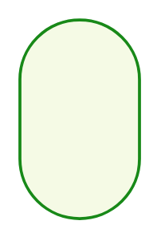

# SAML/OIDC

## Definition

```
{
  _style: 'rounded=1;whiteSpace=wrap;html=1;arcSize=50;strokeColor=#188918;fillColor=#f5fae5;fontColor=#266f3a;strokeWidth=1.5;fontSize=10;fontStyle=1',
  _width: 0,
  _height: 100,
}
```

## Usage

```
import { SamlOidc } from '@diac/standard-components-diagrams/sapEssentials'

<SamlOidc/>
```

## Preview


