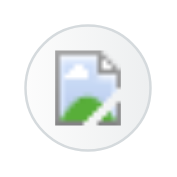

# Application Vulnerability Report

## Definition

```
{
  _style: 'shape=mxgraph.sap.icon;labelPosition=center;verticalLabelPosition=bottom;align=center;verticalAlign=top;strokeWidth=1;strokeColor=#D5DADD;fillColor=#EDEFF0;gradientColor=#FCFCFC;gradientDirection=west;aspect=fixed;SAPIcon=Application_Vulnerability_Report',
  _width: 60,
  _height: 60,
}
```

## Usage

```
import { ApplicationVulnerabilityReport } from '@diac/standard-components-diagrams/sapFoundational'

<ApplicationVulnerabilityReport/>
```

## Preview


