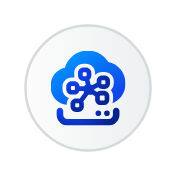

# Sap Integration Suite Entities

- [AdvancedEventMesh](./advanced-event-mesh.md)  

- [ApiBusinessHubEnterprise](./api-business-hub-enterprise.md)  

- [ApiManagment](./api-managment.md)  

- [CloudIntegration](./cloud-integration.md)  

- [DataSpaceIntegration](./data-space-integration.md)  

- [EdgeIntegrationCell](./edge-integration-cell.md)  

- [EventMesh](./event-mesh.md)  

- [IntegrationAdvisor](./integration-advisor.md)  

- [IntegrationAssessment](./integration-assessment.md)  

- [MigrationAssessment](./migration-assessment.md)  

- [OpenConnectors](./open-connectors.md)  

- [SapGraph](./sap-graph.md)  

- [SapIntegrationSuite](./sap-integration-suite.md)  

- [SapBusinessAcceleratorHub](./sap-business-accelerator-hub.md)  

- [TradingPartnerManagement](./trading-partner-management.md)  

