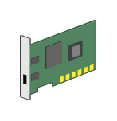

# Network Card

## Definition

```
{
  _style: 'shadow=0;dashed=0;html=1;labelPosition=center;verticalLabelPosition=bottom;verticalAlign=top;align=center;outlineConnect=0;shape=mxgraph.veeam.3d.network_card;',
  _width: 38,
  _height: 40,
}
```

## Usage

```
import { NetworkCard } from '@reactiac/standard-components-diagrams/veeam3d'

<NetworkCard/>
```

## Preview


