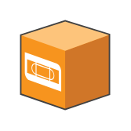

# Tape Server

## Definition

```
{
  _style: 'shadow=0;dashed=0;html=1;labelPosition=center;verticalLabelPosition=bottom;verticalAlign=top;align=center;outlineConnect=0;shape=mxgraph.veeam.3d.tape_server;',
  _width: 46,
  _height: 46,
}
```

## Usage

```
import { TapeServer } from '@diac/standard-components-diagrams/veeam3d'

<TapeServer/>
```

## Preview


