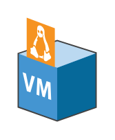

# VM Linux

## Definition

```
{
  _style: { 
    entity: 'shadow=0;dashed=0;html=1;labelPosition=center;verticalLabelPosition=bottom;verticalAlign=top;align=center;outlineConnect=0;shape=mxgraph.veeam.3d.vm_linux;',
  },
  _original_width: 46,
  _original_height: 60,
}
```

## Usage

```
import { VmLinux } from '@diac/standard-components-diagrams/veeam3d'

<VmLinux/>
```

## Preview


