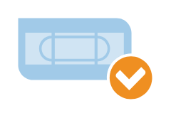

# Tape Checked

## Definition

```
{
  _style: 'shadow=0;dashed=0;html=1;strokeColor=none;fillColor=#4495D1;labelPosition=center;verticalLabelPosition=bottom;verticalAlign=top;align=center;outlineConnect=0;shape=mxgraph.veeam.2d.tape_checked;',
  _width: 75.2,
  _height: 45.6,
}
```

## Usage

```
import { TapeChecked } from '@diac/standard-components-diagrams/veeamVmsAndTape'

<TapeChecked/>
```

## Preview


