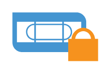

# Tape locked

## Definition

```
{
  _style: 'shadow=0;dashed=0;html=1;strokeColor=none;fillColor=#4495D1;labelPosition=center;verticalLabelPosition=bottom;verticalAlign=top;align=center;outlineConnect=0;shape=mxgraph.veeam.tape_locked;',
  _width: 70.4,
  _height: 40,
}
```

## Usage

```
import { TapeLocked } from '@reactiac/standard-components-diagrams/veeamVmsAndTape'

<TapeLocked/>
```

## Preview


