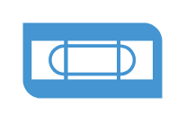

# Tape

## Definition

```
{
  _style: { 
    entity: 'shadow=0;dashed=0;html=1;strokeColor=none;fillColor=#4495D1;labelPosition=center;verticalLabelPosition=bottom;verticalAlign=top;align=center;outlineConnect=0;shape=mxgraph.veeam.2d.tape;',
  },
  _original_width: 62,
  _original_height: 33.6,
}
```

## Usage

```
import { Tape } from '@diac/standard-components-diagrams/veeamVmsAndTape'

<Tape/>
```

## Preview


