# Veeam2 3D Entities

- [Component1ftvm](./component-1ftvm.md)  

- [Component1ftvmError](./component-1ftvm-error.md)  

- [Component1ftvmRunning](./component-1ftvm-running.md)  

- [Component1ftvmUnavailable](./component-1ftvm-unavailable.md)  
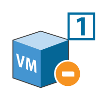

- [Component1ftvmWarning](./component-1ftvm-warning.md)  
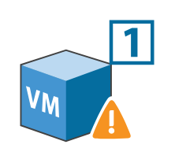

- [Component2ftvm](./component-2ftvm.md)  
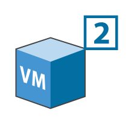

- [Component2ftvmError](./component-2ftvm-error.md)  
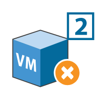

- [Component2ftvmRunning](./component-2ftvm-running.md)  

- [Component2ftvmUnavailable](./component-2ftvm-unavailable.md)  

- [Component2ftvmWarning](./component-2ftvm-warning.md)  
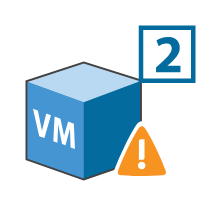

- [BackupRepository](./backup-repository.md)  

- [BackupRepository2](./backup-repository-2.md)  

- [Cd](./cd.md)  

- [Database](./database.md)  

- [Datastore](./datastore.md)  

- [DatastoreSnapshot](./datastore-snapshot.md)  
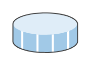

- [DatastoreVolume](./datastore-volume.md)  
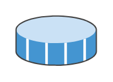

- [EsxEsxi](./esx-esxi.md)  

- [FailoverProtectiveSnapshot](./failover-protective-snapshot.md)  

- [FailoverProtectiveSnapshotLocked](./failover-protective-snapshot-locked.md)  

- [FailoverProtectiveSnapshotRunning](./failover-protective-snapshot-running.md)  
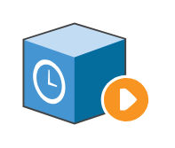

- [FreeDatastore](./free-datastore.md)  

- [FullDatastore](./full-datastore.md)  

- [HardDrive](./hard-drive.md)  

- [HyperVHost](./hyper-v-host.md)  
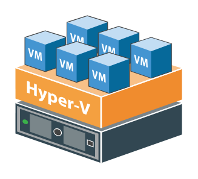

- [LostSpace](./lost-space.md)  

- [Lun](./lun.md)  
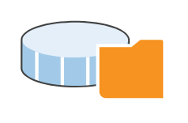

- [MediumDatastore](./medium-datastore.md)  

- [NetworkCard](./network-card.md)  
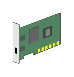

- [PhysicalStorage](./physical-storage.md)  
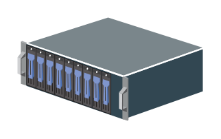

- [Proxy](./proxy.md)  
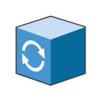

- [ProxyAppliance](./proxy-appliance.md)  
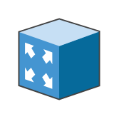

- [RemoteSite](./remote-site.md)  

- [RemoteStorage](./remote-storage.md)  
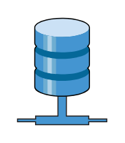

- [ResourcePool](./resource-pool.md)  
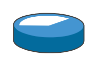

- [ServiceVnic](./service-vnic.md)  
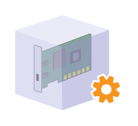

- [Switch](./switch.md)  
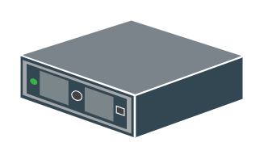

- [Tape](./tape.md)  

- [TapeChecked](./tape-checked.md)  

- [TapeEjecting](./tape-ejecting.md)  
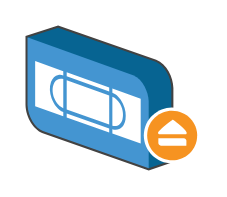

- [TapeLibrary](./tape-library.md)  
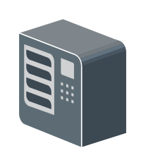

- [TapeLicensed](./tape-licensed.md)  
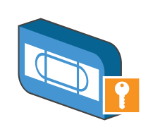

- [TapeRecording](./tape-recording.md)  

- [TapeServer](./tape-server.md)  

- [Vapp](./vapp.md)  
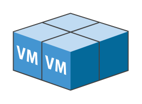

- [VappStarted](./vapp-started.md)  
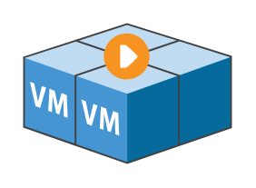

- [VeeamAvailabilitySuite](./veeam-availability-suite.md)  

- [VeeamBackupAndReplicationServer](./veeam-backup-and-replication-server.md)  

- [VeeamBackupEnterpriseManagerServer](./veeam-backup-enterprise-manager-server.md)  

- [VeeamBackupSearchServer](./veeam-backup-search-server.md)  

- [VeeamOneBusinessView](./veeam-one-business-view.md)  

- [VeeamOneMonitor](./veeam-one-monitor.md)  

- [VeeamOneReporter](./veeam-one-reporter.md)  

- [VeeamOneServer](./veeam-one-server.md)  

- [VirtualMachine](./virtual-machine.md)  

- [VmFailed](./vm-failed.md)  
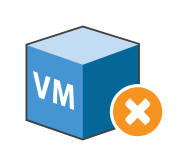

- [VmLinux](./vm-linux.md)  
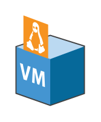

- [VmNoNetwork](./vm-no-network.md)  

- [VmProblem](./vm-problem.md)  
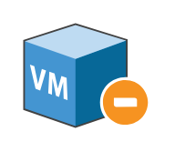

- [VmRunning](./vm-running.md)  

- [VmSavedState](./vm-saved-state.md)  
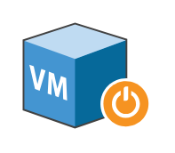

- [VmWindows](./vm-windows.md)  

- [VmwareHost](./vmware-host.md)  
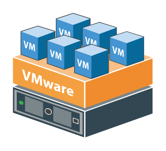

- [Vnic](./vnic.md)  
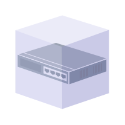

- [WanAccelerator](./wan-accelerator.md)  
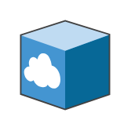

- [Workstation](./workstation.md)  
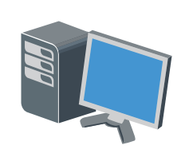
