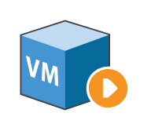

# VM Running

## Definition

```
{
  _style: 'sketch=0;shadow=0;dashed=0;html=1;labelPosition=center;verticalLabelPosition=bottom;verticalAlign=top;align=center;outlineConnect=0;shape=mxgraph.veeam.3d.vm_running;',
  _width: 56,
  _height: 46,
}
```

## Usage

```
import { VmRunning } from '@reactiac/standard-components-diagrams/veeam23d'

<VmRunning/>
```

## Preview


