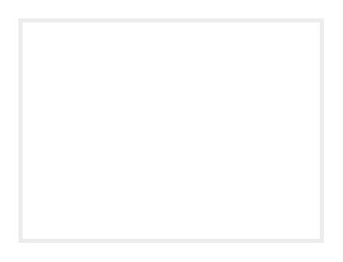

# Font

## Definition

```
{
  _style: 'align=left;verticalAlign=middle;fontFamily=Tahoma;strokeColor=#ECECEC;strokeWidth=2;html=1;whiteSpace=wrap;spacing=6;fontStyle=0',
  _width: 150,
  _height: 110.00000000000001,
}
```

## Usage

```
import { Font } from '@reactiac/standard-components-diagrams/veeam2Auxiliary'

<Font/>
```

## Preview


