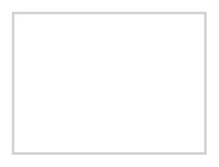

# Frame (grey 2)

## Definition

```
{
  _style: 'rounded=0;whiteSpace=wrap;html=1;fillColor=none;strokeColor=#d3d3d3;strokeWidth=2;',
  _width: 150,
  _height: 110.00000000000001,
}
```

## Usage

```
import { FrameGrey2 } from '@reactiac/standard-components-diagrams/veeam2Auxiliary'

<FrameGrey2/>
```

## Preview


