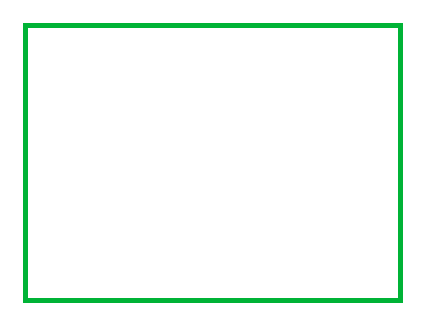

# Frame (topaz)

## Definition

```
{
  _style: { 
    entity: 'rounded=0;whiteSpace=wrap;html=1;fillColor=none;strokeColor=#00B336;strokeWidth=2;',
  },
  _width: 150,
  _height: 110.00000000000001,
}
```

## Usage

```
import { FrameTopaz } from '@diac/standard-components-diagrams/veeam2Auxiliary'

<FrameTopaz/>
```

## Preview


