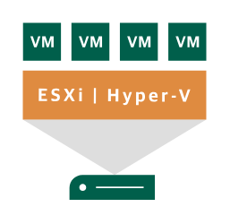

# ESXi/Hyper-V Host

## Definition

```
{
  _style: { 
    entity: 'sketch=0;pointerEvents=1;shadow=0;dashed=0;html=1;strokeColor=none;fillColor=#005F4B;labelPosition=center;verticalLabelPosition=bottom;verticalAlign=top;align=center;outlineConnect=0;shape=mxgraph.veeam2.esxi_hyper_v_host;',
  },
  _width: 82,
  _height: 79,
}
```

## Usage

```
import { EsxiHyperVHost } from '@diac/standard-components-diagrams/veeam2DataCenter'

<EsxiHyperVHost/>
```

## Preview


