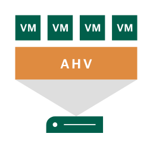
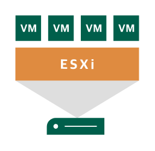
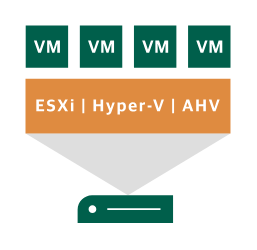

# Veeam2 Data Center Entities

- [Component1uServer](./component-1u-server.md)  

- [AhvHost](./ahv-host.md)  

- [Aws](./aws.md)  

- [Azure](./azure.md)  

- [Cloud](./cloud.md)  

- [Cpu](./cpu.md)  

- [CpuSocket](./cpu-socket.md)  

- [Datacenter](./datacenter.md)  

- [EsxiHost](./esxi-host.md)  

- [EsxiHyperVHost](./esxi-hyper-v-host.md)  

- [EsxiHyperVAhvHost](./esxi-hyper-v-ahv-host.md)  

- [HardwareController](./hardware-controller.md)  

- [Hdd](./hdd.md)  

- [HyperVHost](./hyper-v-host.md)  

- [Laptop](./laptop.md)  

- [LinuxVm](./linux-vm.md)  

- [Monitor](./monitor.md)  

- [NetworkCard](./network-card.md)  

- [PhysicalSwitch](./physical-switch.md)  

- [Ram](./ram.md)  

- [SdCard](./sd-card.md)  

- [Server](./server.md)  

- [ServerCluster](./server-cluster.md)  

- [ServerStack](./server-stack.md)  

- [UsbDrive](./usb-drive.md)  

- [Vapp](./vapp.md)  

- [VappRunning](./vapp-running.md)  

- [VirtualHost](./virtual-host.md)  

- [VirtualMachine](./virtual-machine.md)  

- [VmChecked](./vm-checked.md)  

- [VmFailed](./vm-failed.md)  

- [VmLocked](./vm-locked.md)  

- [VmPausedSavedState](./vm-paused-saved-state.md)  

- [VmRunning](./vm-running.md)  

- [VmSnapshot](./vm-snapshot.md)  

- [VmTurnOnOff](./vm-turn-on-off.md)  

- [VmWithASnapshot](./vm-with-a-snapshot.md)  

- [VmwareVswitch](./vmware-vswitch.md)  

- [WindowsVm](./windows-vm.md)  

- [Workstation](./workstation.md)  

