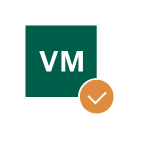

# VM Checked

## Definition

```
{
  _style: { 
    entity: 'sketch=0;pointerEvents=1;shadow=0;dashed=0;html=1;strokeColor=none;fillColor=#005F4B;labelPosition=center;verticalLabelPosition=bottom;verticalAlign=top;align=center;outlineConnect=0;shape=mxgraph.veeam2.vm_checked;',
  },
  _original_width: 36,
  _original_height: 36,
}
```

## Usage

```
import { VmChecked } from '@dinghy/standard-components-diagrams/veeam2DataCenter'

<VmChecked/>
```

## Preview


