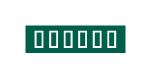

# Storage

## Definition

```
{
  _style: 'sketch=0;pointerEvents=1;shadow=0;dashed=0;html=1;strokeColor=none;fillColor=#005F4B;labelPosition=center;verticalLabelPosition=bottom;verticalAlign=top;align=center;outlineConnect=0;shape=mxgraph.veeam2.storage;',
  _width: 40,
  _height: 11,
}
```

## Usage

```
import { Storage } from '@reactiac/standard-components-diagrams/veeam2Storage'

<Storage/>
```

## Preview


