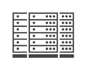

# Datacenter

## Definition

```
{
  _style: 'sketch=0;pointerEvents=1;shadow=0;dashed=0;html=1;strokeColor=none;fillColor=#434445;aspect=fixed;labelPosition=center;verticalLabelPosition=bottom;verticalAlign=top;align=center;outlineConnect=0;shape=mxgraph.vvd.datacenter;',
  _width: 50,
  _height: 37,
}
```

## Usage

```
import { Datacenter } from '@reactiac/standard-components-diagrams/vmwareValidatedDesign'

<Datacenter/>
```

## Preview


