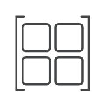

# Site Container

## Definition

```
{
  _style: { 
    entity: 'sketch=0;pointerEvents=1;shadow=0;dashed=0;html=1;strokeColor=none;fillColor=#434445;aspect=fixed;labelPosition=center;verticalLabelPosition=bottom;verticalAlign=top;align=center;outlineConnect=0;shape=mxgraph.vvd.site_container;',
  },
  _original_width: 49.5,
  _original_height: 50,
}
```

## Usage

```
import { SiteContainer } from '@diac/standard-components-diagrams/vmwareValidatedDesign'

<SiteContainer/>
```

## Preview


