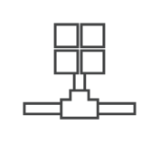

# vApp Network

## Definition

```
{
  _style: { 
    entity: 'sketch=0;pointerEvents=1;shadow=0;dashed=0;html=1;strokeColor=none;fillColor=#434445;aspect=fixed;labelPosition=center;verticalLabelPosition=bottom;verticalAlign=top;align=center;outlineConnect=0;shape=mxgraph.vvd.vapp_network;',
  },
  _width: 50,
  _height: 42.5,
}
```

## Usage

```
import { VappNetwork } from '@diac/standard-components-diagrams/vmwareValidatedDesign'

<VappNetwork/>
```

## Preview


