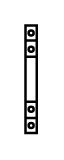

# Auxiliary Contact (Contactor 1-32A)

## Definition

```
{
  _style: 'verticalLabelPosition=bottom;dashed=0;shadow=0;html=1;align=center;verticalAlign=top;shape=mxgraph.cabinets.auxiliary_contact_contactor_1_32a;',
  _width: 4.5,
  _height: 43,
}
```

## Usage

```
import { AuxiliaryContactContactor132a } from '@diac/standard-components-diagrams/cabinets'

<AuxiliaryContactContactor132a/>
```

## Preview


