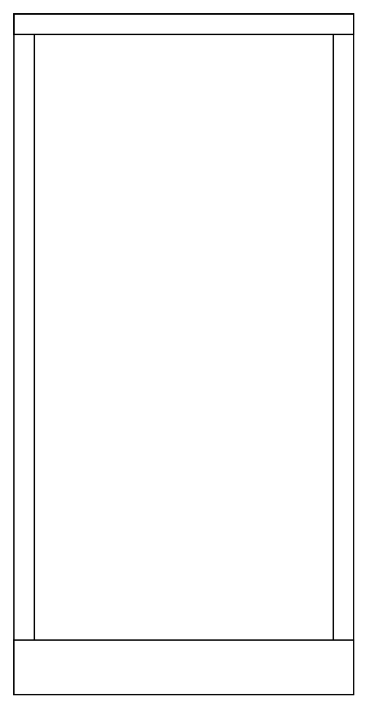

# Cabinet

## Definition

```
{
  _style: { 
    entity: 'verticalLabelPosition=bottom;dashed=0;shadow=0;html=1;align=center;verticalAlign=top;shape=mxgraph.cabinets.cabinet;hasStand=1',
  },
  _original_width: 250,
  _original_height: 500,
}
```

## Usage

```
import { Cabinet } from '@diac/standard-components-diagrams/cabinets'

<Cabinet/>
```

## Preview


