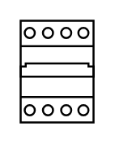

# Circuit Breaker (4P)

## Definition

```
{
  _style: { 
    entity: 'verticalLabelPosition=bottom;dashed=0;shadow=0;html=1;align=center;verticalAlign=top;shape=mxgraph.cabinets.cb_4p;',
  },
  _width: 36,
  _height: 50,
}
```

## Usage

```
import { CircuitBreaker4p } from '@diac/standard-components-diagrams/cabinets'

<CircuitBreaker4p/>
```

## Preview


