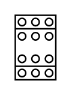

# Contactor (1-32A)

## Definition

```
{
  _style: { 
    entity: 'verticalLabelPosition=bottom;dashed=0;shadow=0;html=1;align=center;verticalAlign=top;shape=mxgraph.cabinets.contactor_1_32a;',
  },
  _width: 27,
  _height: 43,
}
```

## Usage

```
import { Contactor132a } from '@diac/standard-components-diagrams/cabinets'

<Contactor132a/>
```

## Preview


