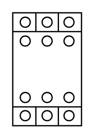

# Contactor 125 to 400A

## Definition

```
{
  _style: { 
    entity: 'verticalLabelPosition=bottom;dashed=0;shadow=0;html=1;align=center;verticalAlign=top;shape=mxgraph.cabinets.contactor_125_400a;',
  },
  _original_width: 55.00000000000001,
  _original_height: 90,
}
```

## Usage

```
import { Contactor125To400a } from '@diac/standard-components-diagrams/cabinets'

<Contactor125To400a/>
```

## Preview


