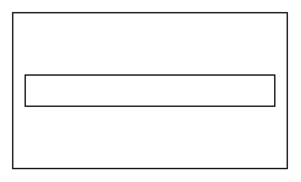

# Cover Plate

## Definition

```
{
  _style: { 
    entity: 'verticalLabelPosition=bottom;dashed=0;shadow=0;html=1;align=center;verticalAlign=top;shape=mxgraph.cabinets.coverPlate',
  },
  _original_width: 220.00000000000003,
  _original_height: 125,
}
```

## Usage

```
import { CoverPlate } from '@dinghy/standard-components-diagrams/cabinets'

<CoverPlate/>
```

## Preview


