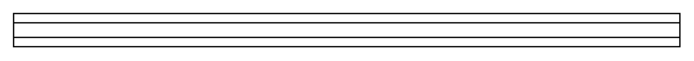

# DIN Rail

## Definition

```
{
  _style: 'verticalLabelPosition=bottom;dashed=0;shadow=0;html=1;align=center;verticalAlign=top;shape=mxgraph.cabinets.din_rail;',
  _width: 500,
  _height: 25,
}
```

## Usage

```
import { DinRail } from '@diac/standard-components-diagrams/cabinets'

<DinRail/>
```

## Preview


