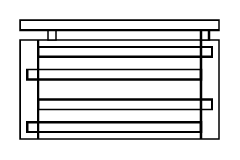

# Distribution Block 4P 125A 11 Connections

## Definition

```
{
  _style: { 
    entity: 'verticalLabelPosition=bottom;dashed=0;shadow=0;html=1;align=center;verticalAlign=top;shape=mxgraph.cabinets.distribution_block_4p_125a_11_connections;',
  },
  _original_width: 100,
  _original_height: 60,
}
```

## Usage

```
import { DistributionBlock4p125a11Connections } from '@dinghy/standard-components-diagrams/cabinets'

<DistributionBlock4p125a11Connections/>
```

## Preview


