# Other Cabinets Entities

- [AuxiliaryContactCircuitBreaker](./auxiliary-contact-circuit-breaker.md)  

- [AuxiliaryContactContactor132a](./auxiliary-contact-contactor-1-32a.md)  

- [AuxiliaryContactContactor32125a](./auxiliary-contact-contactor-32-125a.md)  
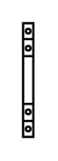

- [Cabinet](./cabinet.md)  

- [CircuitBreaker1p](./circuit-breaker-1p.md)  

- [CircuitBreaker2p](./circuit-breaker-2p.md)  

- [CircuitBreaker3p](./circuit-breaker-3p.md)  

- [CircuitBreaker4p](./circuit-breaker-4p.md)  

- [Contactor132a](./contactor-1-32a.md)  

- [Contactor125To400a](./contactor-125-to-400a.md)  

- [Contactor32To125a](./contactor-32-to-125a.md)  
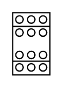

- [CoverPlate](./cover-plate.md)  

- [Dimension](./dimension.md)  

- [Dimension2](./dimension-2.md)  

- [DinRail](./din-rail.md)  

- [DistributionBlock4p125a11Connections](./distribution-block-4p-125a-11-connections.md)  

- [DistributionBlock4p125a11Connections2](./distribution-block-4p-125a-11-connections-2.md)  
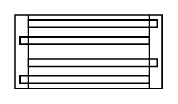

- [Mccb2563a3p](./mccb-25-63a-3p.md)  

- [Mccb2563a4p](./mccb-25-63a-4p.md)  

- [Mccb63250a3p](./mccb-63-250a-3p.md)  

- [Mccb63250a4p](./mccb-63-250a-4p.md)  

- [MotorCircuitBreaker132a](./motor-circuit-breaker-1-32a.md)  
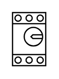

- [MotorCircuitBreaker132a2](./motor-circuit-breaker-1-32a-2.md)  

- [MotorCircuitBreaker125400a](./motor-circuit-breaker-125-400a.md)  

- [MotorCircuitBreaker125400a2](./motor-circuit-breaker-125-400a-2.md)  
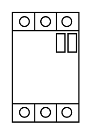

- [MotorCircuitBreaker32125a](./motor-circuit-breaker-32-125a.md)  
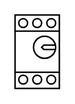

- [MotorCircuitBreaker32125a2](./motor-circuit-breaker-32-125a-2.md)  

- [MotorProtectionCb](./motor-protection-cb.md)  

- [MotorizedSwitch3p](./motorized-switch-3p.md)  

- [MotorizedSwitch4p](./motorized-switch-4p.md)  

- [OvercurrentRelay132a](./overcurrent-relay-1-32a.md)  

- [OvercurrentRelay125400a](./overcurrent-relay-125-400a.md)  
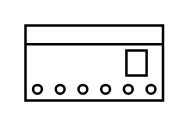

- [OvercurrentRelay32125a](./overcurrent-relay-32-125a.md)  

- [PanelWiringSystem25x40mm](./panel-wiring-system-25x40mm.md)  

- [PanelWiringSystem25x40mmVertical](./panel-wiring-system-25x40mm-vertical.md)  

- [PluginRelay](./plugin-relay.md)  
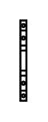

- [PluginRelay2](./plugin-relay-2.md)  

- [ResidualCurrentDevice2p](./residual-current-device-2p.md)  
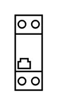

- [ResidualCurrentDevice4p](./residual-current-device-4p.md)  

- [SurgeProtection1p](./surge-protection-1p.md)  

- [SurgeProtection2p](./surge-protection-2p.md)  

- [SurgeProtection3p](./surge-protection-3p.md)  

- [SurgeProtection4p](./surge-protection-4p.md)  

- [Terminal46mm2](./terminal-4-6mm2.md)  
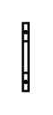

- [Terminal46mm2X10](./terminal-4-6mm2-x10.md)  

- [Terminal40mm2](./terminal-40mm2.md)  

- [Terminal40mm2X10](./terminal-40mm2-x10.md)  

- [Terminal4mm2](./terminal-4mm2.md)  

- [Terminal4mm2X10](./terminal-4mm2-x10.md)  

- [Terminal50mm2](./terminal-50mm2.md)  

- [Terminal50mm2X10](./terminal-50mm2-x10.md)  

- [Terminal625mm2](./terminal-6-25mm2.md)  

- [Terminal625mm2X10](./terminal-6-25mm2-x10.md)  
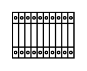

- [Terminal75mm2](./terminal-75mm2.md)  

- [Terminal75mm2X10](./terminal-75mm2-x10.md)  

