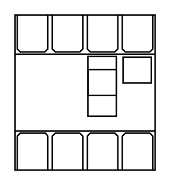

# MCCB 63-250A 4P

## Definition

```
{
  _style: { 
    entity: 'verticalLabelPosition=bottom;dashed=0;shadow=0;html=1;align=center;verticalAlign=top;shape=mxgraph.cabinets.mccb_63_250a_4p;',
  },
  _width: 95,
  _height: 105,
}
```

## Usage

```
import { Mccb63250a4p } from '@diac/standard-components-diagrams/cabinets'

<Mccb63250a4p/>
```

## Preview


