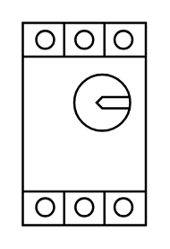

# Motor Circuit Breaker 125-400A

## Definition

```
{
  _style: { 
    entity: 'verticalLabelPosition=bottom;dashed=0;shadow=0;html=1;align=center;verticalAlign=top;shape=mxgraph.cabinets.motor_cb_125_400a;',
  },
  _width: 55.00000000000001,
  _height: 90,
}
```

## Usage

```
import { MotorCircuitBreaker125400a } from '@diac/standard-components-diagrams/cabinets'

<MotorCircuitBreaker125400a/>
```

## Preview


