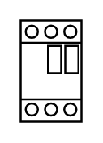

# Motor Circuit Breaker 32-125A 2

## Definition

```
{
  _style: 'verticalLabelPosition=bottom;dashed=0;shadow=0;html=1;align=center;verticalAlign=top;shape=mxgraph.cabinets.motor_starter_32_125a;',
  _width: 30,
  _height: 50,
}
```

## Usage

```
import { MotorCircuitBreaker32125a2 } from '@reactiac/standard-components-diagrams/cabinets'

<MotorCircuitBreaker32125a2/>
```

## Preview


