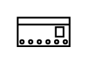

# Overcurrent Relay 32-125A

## Definition

```
{
  _style: 'verticalLabelPosition=bottom;dashed=0;shadow=0;html=1;align=center;verticalAlign=top;shape=mxgraph.cabinets.overcurrent_relay_32_125a;',
  _width: 30,
  _height: 16.5,
}
```

## Usage

```
import { OvercurrentRelay32125a } from '@diac/standard-components-diagrams/cabinets'

<OvercurrentRelay32125a/>
```

## Preview


