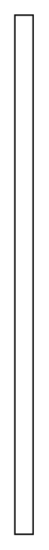

# Panel Wiring System 25x40mm (Vertical)

## Definition

```
{
  _style: 'shape=rect;dashed=0;shadow=0;html=1;whiteSpace=wrap;direction=south;horizontal=0;',
  _width: 12.5,
  _height: 350,
}
```

## Usage

```
import { PanelWiringSystem25x40mmVertical } from '@diac/standard-components-diagrams/cabinets'

<PanelWiringSystem25x40mmVertical/>
```

## Preview


