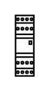

# Plugin Relay 2

## Definition

```
{
  _style: { 
    entity: 'verticalLabelPosition=bottom;dashed=0;shadow=0;html=1;align=center;verticalAlign=top;shape=mxgraph.cabinets.plugin_relay_2;',
  },
  _original_width: 12,
  _original_height: 40,
}
```

## Usage

```
import { PluginRelay2 } from '@dinghy/standard-components-diagrams/cabinets'

<PluginRelay2/>
```

## Preview


