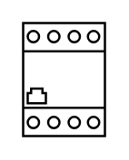

# Residual Current Device 4p

## Definition

```
{
  _style: 'verticalLabelPosition=bottom;dashed=0;shadow=0;html=1;align=center;verticalAlign=top;shape=mxgraph.cabinets.residual_current_device_4p;',
  _width: 36,
  _height: 50,
}
```

## Usage

```
import { ResidualCurrentDevice4p } from '@diac/standard-components-diagrams/cabinets'

<ResidualCurrentDevice4p/>
```

## Preview


