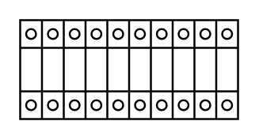

# Terminal 40mm2 x10

## Definition

```
{
  _style: 'verticalLabelPosition=bottom;dashed=0;shadow=0;html=1;align=center;verticalAlign=top;shape=mxgraph.cabinets.terminal_40mm2_x10;',
  _width: 110.00000000000001,
  _height: 50,
}
```

## Usage

```
import { Terminal40mm2X10 } from '@diac/standard-components-diagrams/cabinets'

<Terminal40mm2X10/>
```

## Preview


