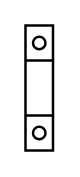

# Terminal 40mm2

## Definition

```
{
  _style: { 
    entity: 'verticalLabelPosition=bottom;dashed=0;shadow=0;html=1;align=center;verticalAlign=top;shape=mxgraph.cabinets.terminal_40mm2;',
  },
  _original_width: 11,
  _original_height: 50,
}
```

## Usage

```
import { Terminal40mm2 } from '@dinghy/standard-components-diagrams/cabinets'

<Terminal40mm2/>
```

## Preview


