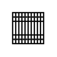

# Terminal 4mm2 x10

## Definition

```
{
  _style: { 
    entity: 'verticalLabelPosition=bottom;dashed=0;shadow=0;html=1;align=center;verticalAlign=top;shape=mxgraph.cabinets.terminal_4mm2_x10;',
  },
  _original_width: 25,
  _original_height: 25,
}
```

## Usage

```
import { Terminal4mm2X10 } from '@diac/standard-components-diagrams/cabinets'

<Terminal4mm2X10/>
```

## Preview


