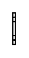

# Terminal 4mm2

## Definition

```
{
  _style: 'verticalLabelPosition=bottom;dashed=0;shadow=0;html=1;align=center;verticalAlign=top;shape=mxgraph.cabinets.terminal_4mm2;',
  _width: 2.5,
  _height: 25,
}
```

## Usage

```
import { Terminal4mm2 } from '@reactiac/standard-components-diagrams/cabinets'

<Terminal4mm2/>
```

## Preview


