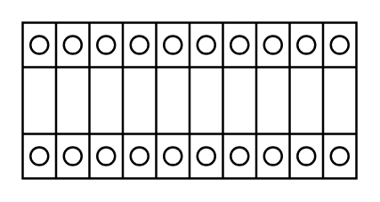

# Terminal 75mm2 x10

## Definition

```
{
  _style: 'verticalLabelPosition=bottom;dashed=0;shadow=0;html=1;align=center;verticalAlign=top;shape=mxgraph.cabinets.terminal_75mm2_x10;',
  _width: 150,
  _height: 70,
}
```

## Usage

```
import { Terminal75mm2X10 } from '@reactiac/standard-components-diagrams/cabinets'

<Terminal75mm2X10/>
```

## Preview


