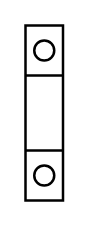

# Terminal 75mm2

## Definition

```
{
  _style: 'verticalLabelPosition=bottom;dashed=0;shadow=0;html=1;align=center;verticalAlign=top;shape=mxgraph.cabinets.terminal_75mm2;',
  _width: 15,
  _height: 70,
}
```

## Usage

```
import { Terminal75mm2 } from '@diac/standard-components-diagrams/cabinets'

<Terminal75mm2/>
```

## Preview


