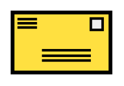

# Return Address

## Definition

```
{
  _style: 'strokeWidth=3;outlineConnect=0;dashed=0;align=center;fontSize=8;shape=mxgraph.eip.retAddr;html=1;verticalLabelPosition=bottom;fillColor=#FFE040;verticalAlign=top;',
  _width: 78,
  _height: 48,
}
```

## Usage

```
import { ReturnAddress } from '@reactiac/standard-components-diagrams/eipMessageConstruction'

<ReturnAddress/>
```

## Preview


