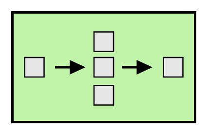
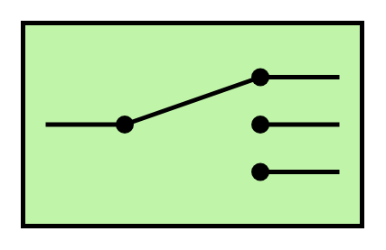
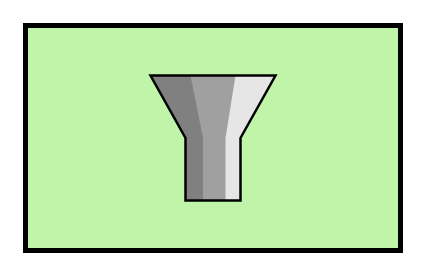
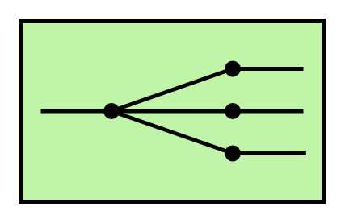
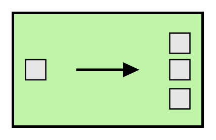

# Eip Message Routing Entities

- [Aggregator](./aggregator.md)  

- [ComposedMessageProcessor](./composed-message-processor.md)  

- [ContentBasedRouter](./content-based-router.md)  

- [DynamicRouter](./dynamic-router.md)  

- [MessageBroker](./message-broker.md)  

- [MessageBroker2](./message-broker-2.md)  

- [MessageBroker3](./message-broker-3.md)  

- [MessageFilter](./message-filter.md)  

- [ProcessManager](./process-manager.md)  

- [RecipientList](./recipient-list.md)  

- [Resequencer](./resequencer.md)  

- [RoutingSlip](./routing-slip.md)  

- [Splitter](./splitter.md)  

