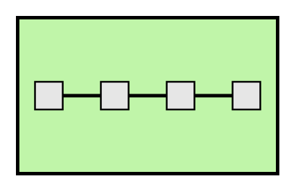

# Routing Slip

## Definition

```
{
  _style: { 
    entity: 'html=1;strokeWidth=2;outlineConnect=0;dashed=0;align=center;fontSize=8;fillColor=#c0f5a9;verticalLabelPosition=bottom;verticalAlign=top;shape=mxgraph.eip.routing_slip;',
  },
  _width: 150,
  _height: 90,
}
```

## Usage

```
import { RoutingSlip } from '@diac/standard-components-diagrams/eipMessageRouting'

<RoutingSlip/>
```

## Preview


