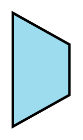

# Channel Adapter

## Definition

```
{
  _style: 'strokeWidth=2;outlineConnect=0;dashed=0;align=center;html=1;fontSize=8;shape=mxgraph.eip.channel_adapter;fillColor=#9ddbef;',
  _width: 45,
  _height: 90,
}
```

## Usage

```
import { ChannelAdapter } from '@reactiac/standard-components-diagrams/eipMessagingChannels'

<ChannelAdapter/>
```

## Preview


