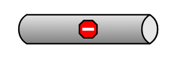

# Dead Letter Channel

## Definition

```
{
  _style: 'strokeWidth=1;outlineConnect=0;dashed=0;align=center;html=1;fontSize=8;shape=mxgraph.eip.deadLetterChannel;verticalLabelPosition=bottom;labelBackgroundColor=#ffffff;verticalAlign=top;',
  _width: 100,
  _height: 20,
}
```

## Usage

```
import { DeadLetterChannel } from '@reactiac/standard-components-diagrams/eipMessagingChannels'

<DeadLetterChannel/>
```

## Preview


