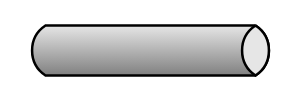

# Message Channel

## Definition

```
{
  _style: { 
    entity: 'strokeWidth=1;outlineConnect=0;dashed=0;align=center;html=1;fontSize=8;shape=mxgraph.eip.messageChannel;verticalLabelPosition=bottom;labelBackgroundColor=#ffffff;verticalAlign=top;',
  },
  _original_width: 100,
  _original_height: 20,
}
```

## Usage

```
import { MessageChannel } from '@diac/standard-components-diagrams/eipMessagingChannels'

<MessageChannel/>
```

## Preview


