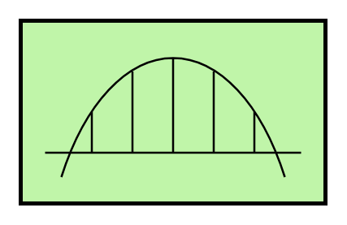

# Messaging Bridge

## Definition

```
{
  _style: 'strokeWidth=2;outlineConnect=0;dashed=0;align=center;html=1;fontSize=8;shape=mxgraph.eip.messaging_bridge;verticalLabelPosition=bottom;verticalAlign=top;fillColor=#c0f5a9;',
  _width: 150,
  _height: 90,
}
```

## Usage

```
import { MessagingBridge } from '@diac/standard-components-diagrams/eipMessagingChannels'

<MessagingBridge/>
```

## Preview


